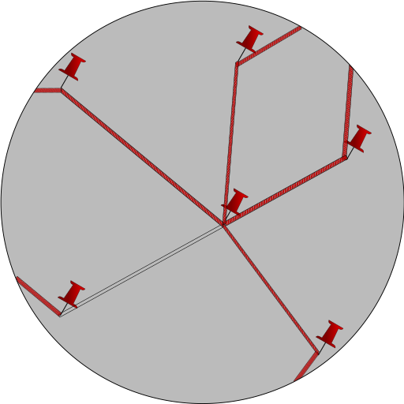

# TCDB

## Русский
TCDB (trade connection database)
- база данных торговых связей между компаниями, фондами и людьми. 
В данный момент база находится в стадии разработки, но ниже изложено наше видение её развития.

#### Концепция
DIY торговая блокада помогла сторонникам Ганди освободить свою страну ненасильственно, однако современный рынок устроен несколько сложнее, поэтому устроить DIY торговую блокаду Путину (или другому человеку, творящему зверства) сложно.  
Эта база данных - инструмент для того, чтобы осознанные люди могли финансово давить на людей, творящих зверства по всему миру, не дожидаясь санкций от своей страны и обрезая опосредованные связи через страны, не вводившие санкций.  

#### Структура
 - веб-сервер, написанный на fastapi и предоставляющий REST API на добавление и чтение данных
 - typesense сервер для быстрого полнотекстового поиска
 - база данных, в которой хранятся все наши данные. В настоящий момент это postgresql
 - питоновская обёртка над API для того, чтобы легко читать и записывать данные программно
 - html/js клиент для удобного просмотра данных простыми интернет-пользователями
 
 #### Заполнение
 В первую очередь мы будем парсить данные с нефтяных бирж, чтобы увидеть, куда идёт нефть, однако есть множество других открытых данных, из которых можно достать немало торговых связей, например:  
  - финотчётность компаний
  - пресс-релизы, статьи новостных изданий
  - различные сливы, например, архив Пандоры
  
Источников данных и методов их сборки может быть множество, поэтому мы и делаем API, чтобы любой разработчик мог добавлять данные (в хорошем варианте развития событий это станет основным источником наших данных). 
 
#### Использование
Когда наберётся достаточно данных, база может быть использована журналистами новостных изданий, блогерами и любой персоной для того, чтобы сделать свою жизнь (и мир) капельку этичнее.

#### Контакты
tcdb.head@gmail.com
telegram: https://t.me/tcdb_contact_bot

#### Демки
демка полнотекстового поиска (да, у нас нет фронтендера)
[demo.webm](https://user-images.githubusercontent.com/36077611/177140719-f1eaaf1c-123c-4127-b84c-3194c38a9583.webm)

Любая помощь приветствуется.  
Если вы читаете это, вы и есть сопротивление, вместе хорошие люди победят.

## English
TCDB (trade connection database) - database of trade connections between companies, foundations and people.
At the moment the project is in the development stage, but that's how I see it in the future.

#### Concept
DIY trade embargo helped Ghandi and his followers to liberate their country without violence, but nowadays the market is much more complex than it used to be, so you can't make a DIY trade embargo on Putin (or any other person that is doing something alike).  
TCDB is a tool to create financial pressure on people doing something *wrong* without waiting for an oficial trade embargo from their government and cutting off indirect connections via the countries that didn't join to embargo.  

#### Structure
 - web-server on fastapi with REST API for reading and adding data.
 - typeserver for an instant full-text search.
 - The database itself, postgresql at the moment
 - python wrapper on API so that data could be easily accessed and added programmatically
 - html/js client for a convenient data representation for humans.

#### Data sources
First of all, we are going to parse oil stock data, but there are lots of potential sources:
 - financial reports of companies
 - press-releases, newspaper articles
 - Various data leaks (e.g. Pandora archive)
 
Data sources and methods of their handling are very diverse, that's why we're creating an API for data submission, we hope that volunteers all over the world will help us with data mining.  

#### Usage
When we will have enough data the database can be used by news agencies, bloggers and other people trying to make their life (and the world) a bit more ethical.  

#### Contacts
tcdb.head@gmail.com  
telegram: https://t.me/tcdb_contact_bot

#### Demos
Demo of an instantsearch (yes, i we don't have a frontender)
[demo.webm](https://user-images.githubusercontent.com/36077611/177140719-f1eaaf1c-123c-4127-b84c-3194c38a9583.webm)

Any assistance is highly appreciated.  
If you are reading this, you are the resistance, together we can change the world.  
